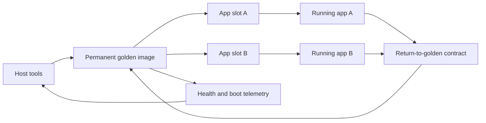

# Architecture

GoldenGate FPGA is split into three planes:

1. **Golden plane**
   - permanent bitstream at a protected flash address
   - exposes the golden control BAR or equivalent control channel
   - validates slot metadata and image hashes
   - starts warmboot/IPROG into selected app slots
   - records boot and recovery events
   - monitors temperature and other health signals

2. **Application plane**
   - one or more product bitstreams in update slots
   - exposes an app contract page for heartbeat, build identity, and return
   - may expose product-specific registers, video, audio, sensors, or DMA
   - should never be required for board recovery

3. **Host plane**
   - writes images into slots
   - verifies flash readback
   - asks golden to boot a verified app
   - re-enumerates the transport if warmboot resets the endpoint
   - reads health, boot reason, heartbeat, watchdog, and event logs

## Cold Boot

The FPGA configures from the protected golden image. Golden exposes an identity
page, health page, slot metadata, and warmboot controls. The host should treat
this as the only reliable initial state.

## App Boot

The host writes an app image to a slot, verifies it, and writes a manifest. The
host then asks golden to warmboot the payload address. Golden rejects unsafe
addresses, unaligned addresses, protected-region addresses, and missing
confirmation.

## Transport Re-entry

Full-chip warmboot usually resets the FPGA fabric. If the host transport is PCIe,
the endpoint may disappear and reappear. Prefer PCIe hot remove/rescan plus
driver reload over rebooting the host, because a host reboot may assert PERST#
and coldboot the FPGA back to golden.

## App Health

Every app should expose a small standard page:

- app magic and ABI version
- app build id
- heartbeat counter
- app status flags
- return-to-golden request register
- optional watchdog pet page

The product can expose any additional interfaces it needs, but these standard
signals keep infrastructure independent of the product.

## Recovery

The system should support at least three recovery paths:

- app voluntarily returns to golden
- golden refuses to boot an invalid slot
- watchdog returns to golden when an app stops petting it

Failure-path proof requires a deliberately bad or wedging fixture. A working app
proves the happy path, not fallback.

